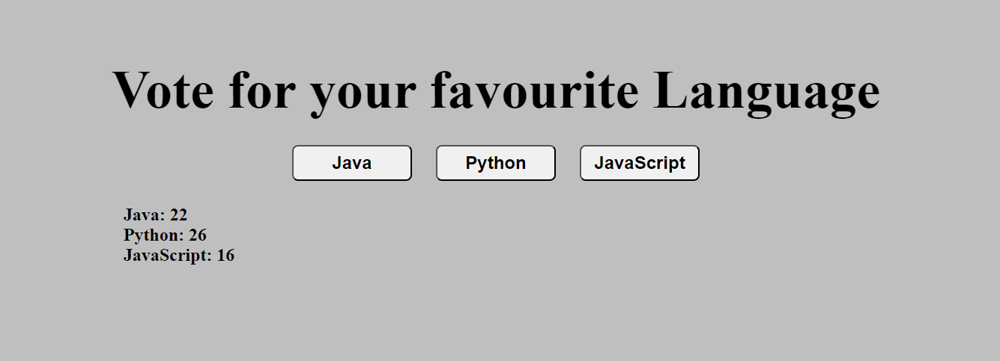

# Full Stack Development (CSE204) Practical File

## Practical 1
**Real time voting system. Created using simple HTML, CSS & JS**
- Output
  

## Practical 2
**Real Time weather application. Provides citywise temperature. works on API**
- Output
  

**[Note: Internet is required]**

## Practical 3
## Practical 4
## Practical 5
## Practical 6
## Practical 7
